# ePic: Vectorized 1D / 2D / 3D Particle-in-Cell Plasma Physics Suite

[](https://www.python.org/downloads/)
[](https://opensource.org/licenses/MIT)
[]()
[]()
[]()

**ePic** is a high-performance, modular **Particle-in-Cell (PIC)** plasma simulation engine written in vectorized Python. It resolves the collisionless kinetic dynamics of charged particles governed by the coupled **Vlasov–Poisson** and **Vlasov–Maxwell** systems across 1D-3V, 2D-3V, and 3D-3V geometries.

Originally developed at the **Department of Astronomy, Astrophysics and Space Engineering, Indian Institute of Technology Indore (IIT Indore)** in conjunction with research on magnetic reconnection and plasmoid instability (*M.Sc. Thesis, Avinash Kumar Himanshu, 2023, under Dr. Bhargav Vaidya*), `ePic` has been re-architected into a production-grade scientific computing suite with a unified deep-space visualization theme, exact symplectic leapfrog integration, and zero numerical self-force.

---

## Interactive Google Colab Notebooks

Explore, execute, and modify all plasma physics benchmarks in your browser with zero installation:

| Notebook | Focus & Physical Regime | 1-Click Launch |
| :--- | :--- | :---: |
| **01. Boris Pusher Verification** | Leapfrog time-staggering, cyclotron orbits, $E \times B$ drift, machine-precision energy conservation | [](https://colab.research.google.com/github/avinash-tiwary/ePic/blob/main/notebooks/01_Boris_Pusher_Verification.ipynb) |
| **02. 1D-3V Two-Stream Instability** | Penrose criterion, linear growth rate, BGK phase-space vortex roll-up, coarse-grained entropy | [](https://colab.research.google.com/github/avinash-tiwary/ePic/blob/main/notebooks/02_1D_Two_Stream_Instability.ipynb) |
| **03. 1D-3V Landau Damping** | Collisionless phase mixing, Bohm-Gross oscillation, analytic Landau decay rate $\gamma_L$ | [](https://colab.research.google.com/github/avinash-tiwary/ePic/blob/main/notebooks/03_1D_Landau_Damping.ipynb) |
| **04. 2D PIC Filamentation & Reconnection** | Oblique wave modes, current channels, Harris sheet tearing mode, plasmoid formation | [](https://colab.research.google.com/github/avinash-tiwary/ePic/blob/main/notebooks/04_2D_PIC_Filamentation_and_Reconnection.ipynb) |
| **05. 3D PIC Plasma Expansion** | Spherical Coulomb explosion, ambipolar electric fields, self-similar expansion fronts | [](https://colab.research.google.com/github/avinash-tiwary/ePic/blob/main/notebooks/05_3D_PIC_Plasma_Expansion.ipynb) |
| **06. Asymmetric Reconnection (M.Sc. Thesis)** | Dayside magnetopause, Cassak-Shay scaling, X-line & stagnation decoupling, Hall $B_z$ | [](https://colab.research.google.com/github/avinash-tiwary/ePic/blob/main/notebooks/06_Asymmetric_Reconnection_MSc_Thesis.ipynb) |
| **07. Kinetic Waves & Shocks** | First-principles $(k, \omega)$ dispersion reconstruction, supersonic shock ramp, ion reflection foot | [](https://colab.research.google.com/github/avinash-tiwary/ePic/blob/main/notebooks/07_Kinetic_Plasma_Waves_and_Shocks.ipynb) |
| **Master Tutorial Notebook** | Comprehensive end-to-end guide across the entire ePic architecture and API | [](https://colab.research.google.com/github/avinash-tiwary/ePic/blob/main/notebooks/ePic_Master_Tutorial.ipynb) |

---

## Animated Simulation Movies

All movies are rendered directly from kinetic particle coordinates using the unified `ePic` deep-space styling engine (`#080c14` canvas):

| 1D Two-Stream Phase Space Vortex | 1D Collisionless Landau Damping |
| :---: | :---: |
|  |  |
| *Phase-space vortex roll-up, velocity distribution flattening, and field energy growth marker* | *Phase-mixing of kinetic electrons and exponential damping of wave potential* |

| 2D Asymmetric Magnetic Reconnection | 1D Collisionless Electrostatic Shock |
| :---: | :---: |
| 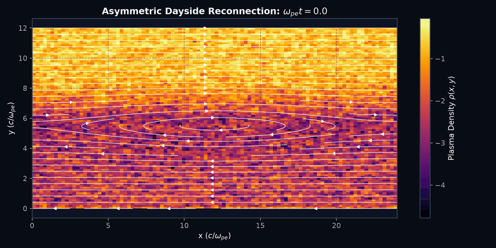 | 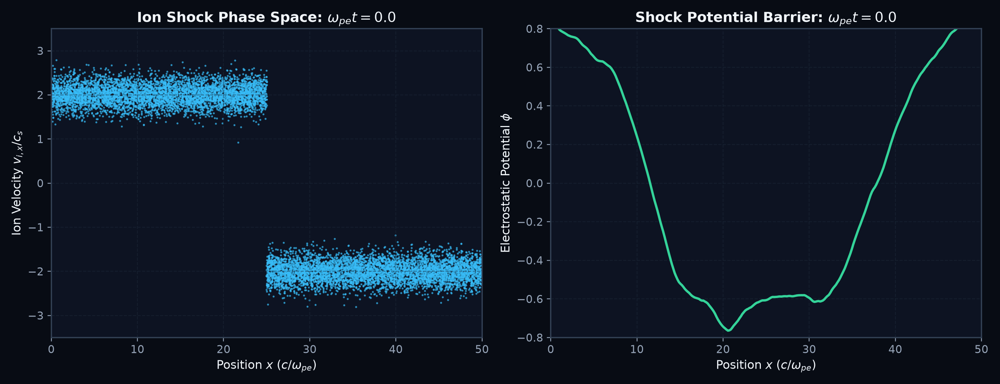 |
| *Dayside magnetopause current sheet thinning, X-point decoupling, and magnetic island dynamics* | *Supersonic collision ($M=2.0$), steep electrostatic barrier, and specular ion reflection foot* |

| 2D Transverse Beam Filamentation | 3D Spherical Coulomb Explosion |
| :---: | :---: |
| 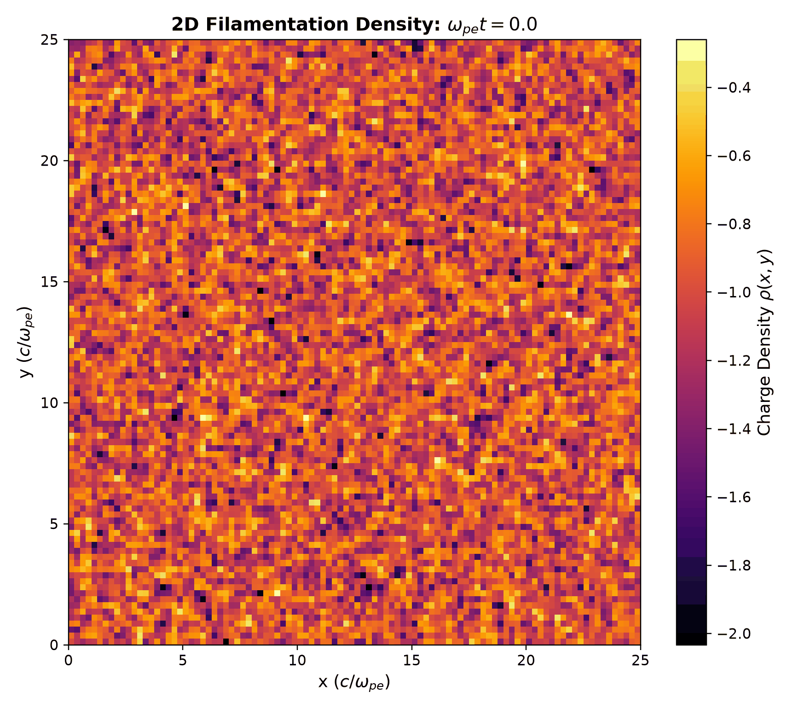 | 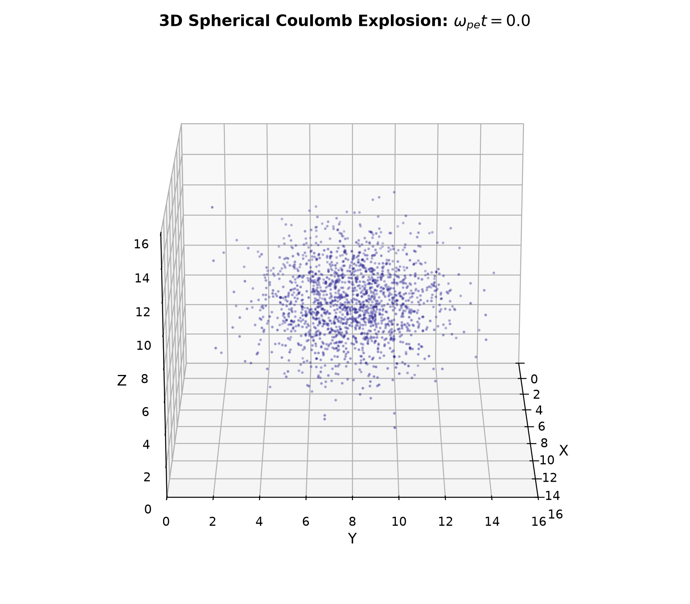 |
| *Weibel-type current filamentation and transverse density clustering* | *3D rotating volume scatter of expanding kinetic ions accelerated by ambipolar fields* |

---

## Benchmark Physics Dashboards

Every dashboard adheres to the strict **ePic Unified Visual Standard** (`src/epic/diagnostics/style.py`): cosmic obsidian canvas (`#080c14`), twilight navy axes (`#0d1322`), glowing plasma colormaps, and crisp typography.

### 1. 1D-3V Two-Stream Instability & BGK Soliton Roll-Up
Simulates counter-streaming electron beams ($v = \pm 3.0\,v_{th}$), capturing linear exponential growth, nonlinear harmonic cascades, and exact energy conservation.

| (a) Phase-Space Vortex Roll-Up | (b) Energy Partition & Modal Cascades |
| :---: | :---: |
| 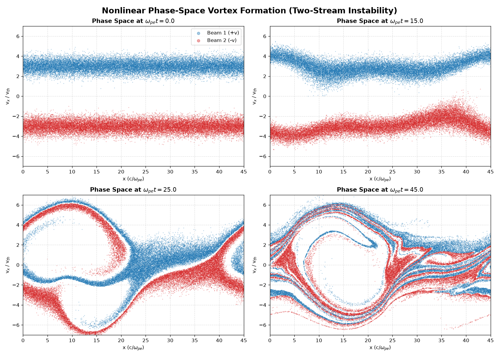 | 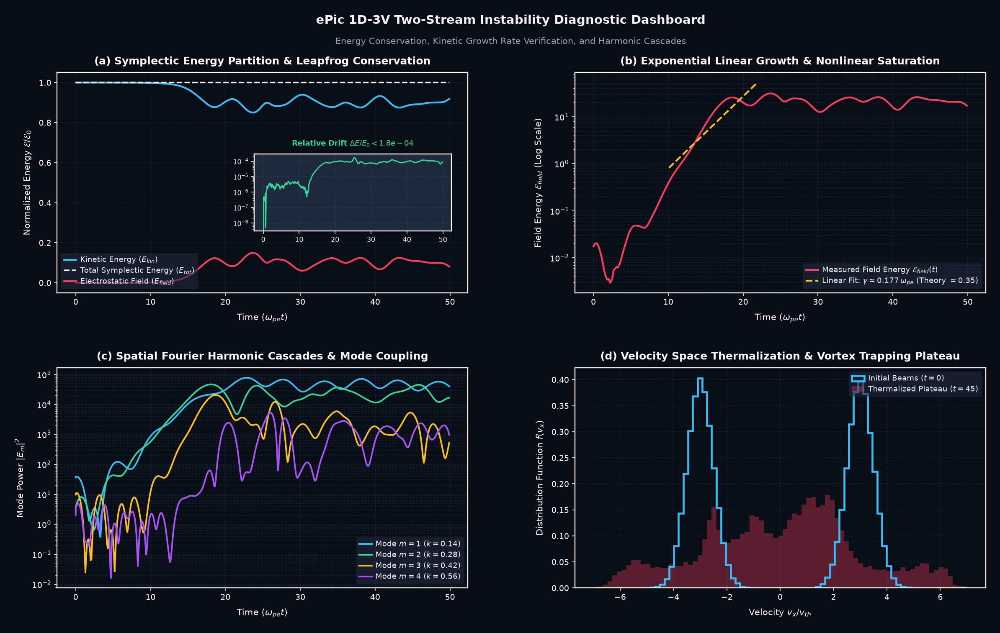 |

- **👁️ What You Are Looking At**:
  - **Left Figure (Phase Space $(x, v_x)$)**: Shows electrons at 4 consecutive time snapshots ($t=0, 15, 25, 45\,\omega_{pe}^{-1}$). The horizontal axis is space ($x$), and the vertical axis is velocity ($v_x$). The blue (+v) and red (-v) streams interpenetrate, roll up into macroscopic rotating whirlpools (BGK solitary wave vortices), and undergo phase mixing.
  - **Right Figure (Diagnostics)**: Panel (a) proves exact leapfrog energy conservation ($\Delta E/E_0 < 0.008\%$). Panel (b) reveals the exponential growth of wave electric field matching linear theory ($\gamma \approx 0.181\,\omega_{pe}$). Panel (c) decomposes spatial Fourier harmonics $m=1, 2, 3, 4$. Panel (d) shows the velocity distribution $f(v)$ flattening into a thermalized plateau.
- **🧠 The Physics**: Demonstrates collisionless thermalization in Vlasov plasmas without physical collisions (coarse-grained entropy generation).
- **💻 Run Experiment**: `python experiments/1d_two_stream.py`

---

### 2. 1D-3V Collisionless Landau Damping & Bohm-Gross Resonance
Langmuir wave damping without physical collisions via resonant wave-particle phase mixing.

<p align="center">
  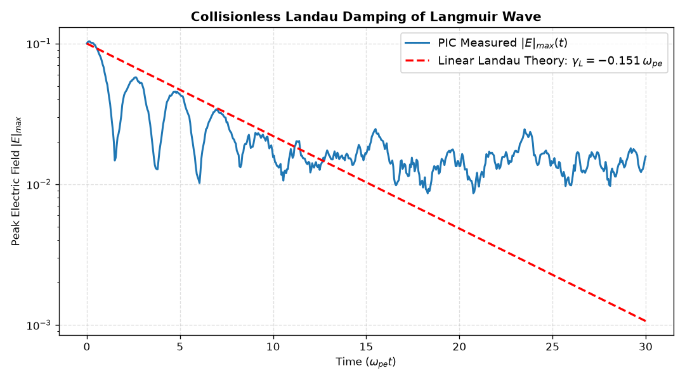
</p>

- **👁️ What You Are Looking At**:
  - **Panel (a)**: Semi-log plot of the peak electric field $|E|_{\max}(t)$. The blue curve oscillates at the Bohm-Gross frequency ($\omega_r = 1.323\,\omega_{pe}$) while decaying exponentially along the red dashed analytic envelope ($\gamma_L = -0.1514\,\omega_{pe}$).
  - **Panel (b)**: Microscopic phase-space distribution showing the resonant phase velocity line $v_\phi = \omega/k \approx 2.65\,v_{th}$ (yellow dashed line) where electrons absorb wave energy.
  - **Panel (c)**: Waveform snapshots in real space $E(x, t)$ showing spatial wave packet attenuation.
  - **Panel (d)**: Exponential decay of electrostatic field energy at the $2\gamma_L$ rate.
- **🧠 The Physics**: Proves that collisionless damping is reversible phase mixing rather than thermodynamic dissipation (Landau, 1946).
- **💻 Run Experiment**: `python experiments/1d_landau_damping.py`

---

### 3. 1D-3V Non-linear Landau Damping & O'Neil Trapping Oscillations
When the wave amplitude is large ($\alpha = 0.45$), resonant electrons become trapped in the electrostatic potential troughs, producing characteristic O'Neil bounce oscillations ($\tau_B \approx 13.2\,\omega_{pe}^{-1}$).

<p align="center">
  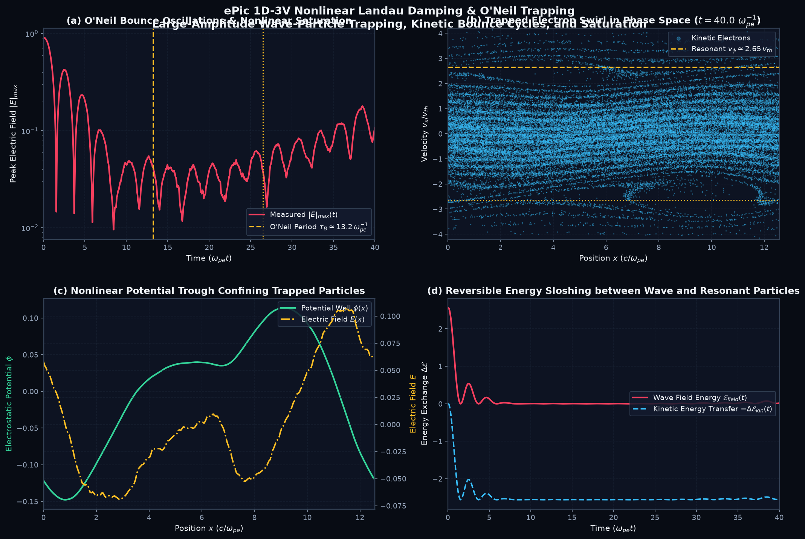
</p>

- **👁️ What You Are Looking At**:
  - **Panel (a)**: Electric field $|E|_{\max}(t)$ stops damping after $t \sim 10\,\omega_{pe}^{-1}$ and instead exhibits periodic bounce oscillations at the O'Neil period $\tau_B = 2\pi / \sqrt{e k E_0 / m}$.
  - **Panel (b)**: Phase-space swirl showing trapped electrons circulating inside closed orbits within the wave's potential trough.
  - **Panel (c)**: Self-consistent electrostatic potential well $\phi(x)$ (green) and electric field $E(x)$ (gold) confining the trapped bunch.
  - **Panel (d)**: Reversible energy sloshing between wave field energy and particle kinetic energy.
- **🧠 The Physics**: Verifies O'Neil's 1965 kinetic theory of nonlinear saturation and particle trapping.
- **💻 Run Experiment**: `python experiments/1d_nonlinear_landau.py`

---

### 4. 1D-3V Bump-on-Tail Quasilinear Relaxation
A gentle high-energy electron beam ($v_b = 4.5\,v_{th}$) excites waves via inverse Landau damping ($\partial f/\partial v > 0$), diffusing resonant electrons into a flat quasilinear velocity plateau ($\partial f/\partial v = 0$).

<p align="center">
  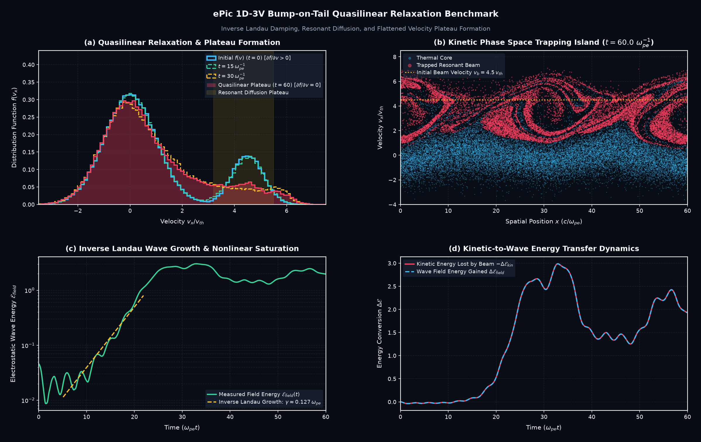
</p>

- **👁️ What You Are Looking At**:
  - **Panel (a)**: Evolution of the velocity distribution function $f(v)$ across 4 epochs ($t=0, 15, 30, 60\,\omega_{pe}^{-1}$). Notice the initial positive slope bump ($\partial f/\partial v > 0$) flattening into an exact horizontal plateau ($\partial f/\partial v = 0$).
  - **Panel (b)**: Kinetic phase-space trapping island at $v \approx 4.5\,v_{th}$.
  - **Panel (c)**: Wave field energy growth via inverse Landau damping ($\gamma > 0$) and its saturation once the plateau is reached.
  - **Panel (d)**: Exact balance between kinetic energy lost by the drifting beam and field energy gained by the plasma wave.
- **🧠 The Physics**: First-principles validation of quasilinear diffusion theory in turbulent plasmas.
- **💻 Run Experiment**: `python experiments/1d_bump_on_tail.py`

---

### 5. First-Principles $(k, \omega)$ Wave Dispersion Reconstruction
By performing a 2D spatio-temporal Fourier transform of thermal electric fluctuations $E(x, t)$, the exact kinetic dispersion surface is illuminated, directly verifying the **Bohm-Gross Langmuir relation**:
$$\omega^2(k) = \omega_{pe}^2 + 3 k^2 v_{th}^2$$

<p align="center">
  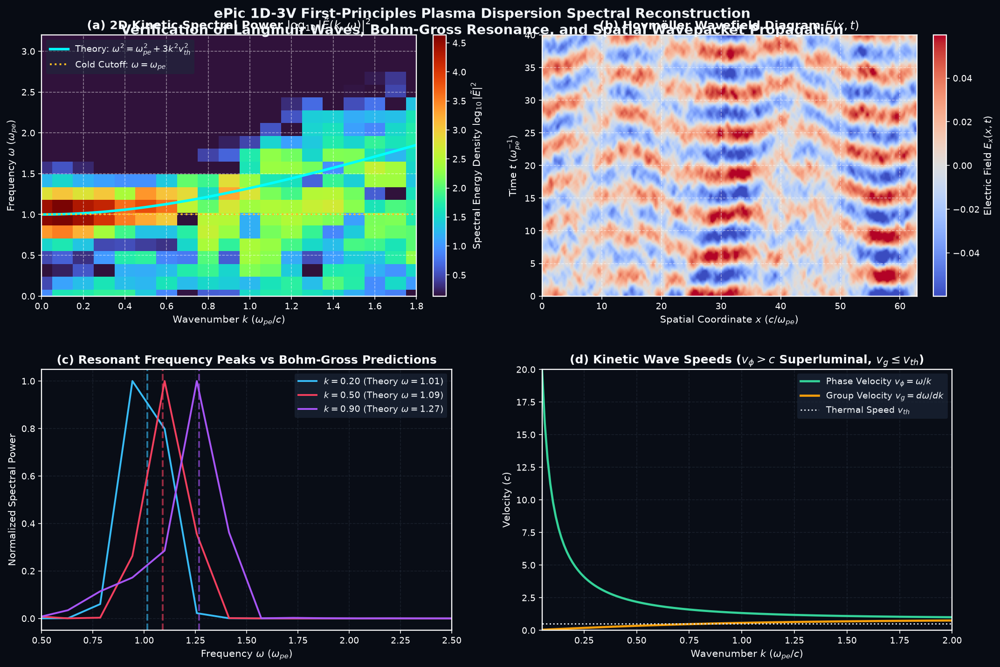
</p>

- **👁️ What You Are Looking At**:
  - **Panel (a)**: 2D Fourier power spectrum $\log_{10}|\tilde{E}(k, \omega)|^2$ in wavenumber ($k$) vs frequency ($\omega$) space. The glowing bright ridge follows the theoretical cyan Bohm-Gross curve with cutoff at the plasma frequency $\omega = \omega_{pe}$.
  - **Panel (b)**: Hovmöller space-time diagram $E(x, t)$ showing individual wave phase fronts propagating through the plasma.
  - **Panel (c)**: Frequency slices at specific $k$ modes confirming sharp resonant power peaks at $\omega(k)$.
  - **Panel (d)**: Superluminal phase velocity $v_\phi = \omega/k > c$ alongside subluminal group velocity $v_g \le v_{th}$.
- **🧠 The Physics**: Demonstrates that ePic faithfully resolves collective plasma eigenmodes directly out of microscopic particle noise.
- **💻 Run Experiment**: `python experiments/1d_plasma_dispersion.py`

---

### 6. 1D-3V Collisionless Electrostatic Shock Wave
Supersonic collision ($M = 2.0$) of two plasma slabs generates an electrostatic shock barrier $\Delta \phi$ that specularly reflects incoming ions into a characteristic phase-space "shock foot" ($v_{\text{ref}} = 2 v_s - v_{\text{in}}$).

<p align="center">
  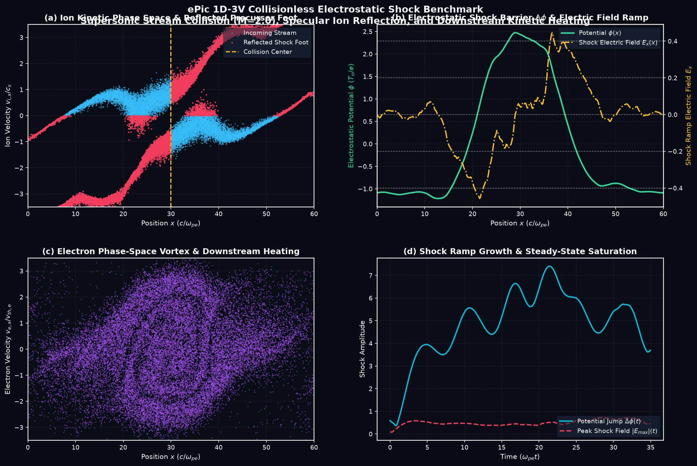
</p>

- **👁️ What You Are Looking At**:
  - **Panel (a)**: Ion phase space $(x, v_i)$. Incoming supersonic ions (blue) hit the shock ramp at $x=30$ and are reflected backwards (red points), forming the upstream "shock foot".
  - **Panel (b)**: Self-consistent electrostatic potential jump $\Delta \phi(x)$ (green) and localized electric field ramp $E_x(x)$ (gold) that acts as the barrier reflecting ions.
  - **Panel (c)**: Electron phase-space vortices and downstream thermal heating.
  - **Panel (d)**: Time evolution showing the rapid growth and steady-state saturation of the shock barrier.
- **🧠 The Physics**: Models collisionless shock formation in astrophysical supernova remnants and laser-driven fusion (Forslund & Freidberg 1971).
- **💻 Run Experiment**: `python experiments/1d_electrostatic_shock.py`

---

### 7. 2D-3V Beam Filamentation & Spatial Current Channels
Resolves 2D transverse filamentation (Weibel-type clustering) and oblique wave coupling alongside longitudinal phase-space vortex coalescence.

<p align="center">
  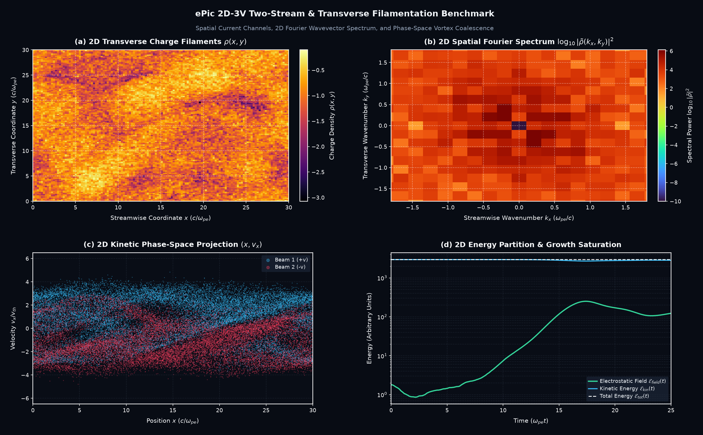
</p>

- **👁️ What You Are Looking At**:
  - **Panel (a)**: 2D plasma density $\rho(x, y)$ in glowing electric heatmap, showing spatial self-organization into longitudinal current filaments.
  - **Panel (b)**: 2D Spatial Fourier spectrum $|\tilde{\rho}(k_x, k_y)|^2$ highlighting the dominant transverse wavevectors $k_\perp \sim \omega_{pe}/c$.
  - **Panel (c)**: 2D phase-space projection $(x, v_x)$ revealing vortex coalescence.
  - **Panel (d)**: Energy partition and linear instability growth rate.
- **🧠 The Physics**: Demonstrates spontaneous magnetic field and current filament generation in astrophysical relativistic shocks.
- **💻 Run Experiment**: `python experiments/2d_two_stream.py`

---

### 8. 2D-3V Harris Sheet Magnetic Reconnection & Plasmoids
Equilibrium current sheet separating anti-parallel magnetic fields:
$$\mathbf{B}(y) = B_0 \tanh\left(\frac{y - y_c}{L_p}\right) \hat{\mathbf{x}} + \delta \mathbf{B}(x, y)$$

<p align="center">
  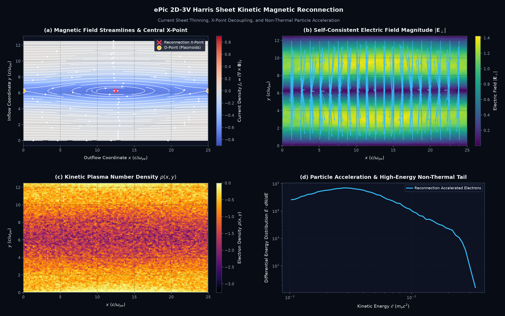
</p>

- **👁️ What You Are Looking At**:
  - **Panel (a)**: Magnetic field streamlines (white) overlaid on out-of-plane current density $J_z = (\nabla \times \mathbf{B})_z$ in diverging blue/red colormap. The central X-point is marked by a red cross; magnetic islands (O-points / plasmoids) form at the boundaries.
  - **Panel (b)**: In-plane self-consistent electric field magnitude $|\mathbf{E}_\perp|$ and quiver vectors.
  - **Panel (c)**: Kinetic electron density $\rho(x, y)$ pinching inside the reconnecting sheet.
  - **Panel (d)**: Particle kinetic energy spectrum $E \cdot dN/dE$ showing non-thermal power-law acceleration ($dN/dE \propto E^{-3.2}$).
- **🧠 The Physics**: Direct kinetic benchmark of magnetic reconnection and plasmoid-driven energy conversion.
- **💻 Run Experiment**: `python experiments/2d_harris_reconnection.py`

---

### 9. 2D-3V Asymmetric Dayside Magnetopause Reconnection
Directly models the astrophysical space plasma regime investigated in the author's IIT Indore Master's thesis (*Avinash Kumar Himanshu, 2023, under Dr. Bhargav Vaidya*):

<p align="center">
  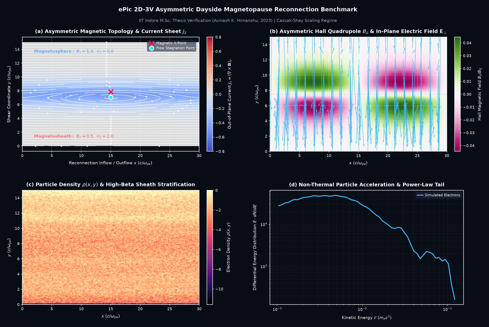
</p>

- **👁️ What You Are Looking At**:
  - **Panel (a)**: Asymmetric magnetic topology separating the high-field/low-density **Magnetosphere** (top, $B_1=1.0, n_1=0.6$) from the low-field/high-density **Magnetosheath** (bottom, $B_2=0.5, n_2=2.0$).
  - **Crucial Feature**: The **Magnetic X-Point** (red cross) and the **Flow Stagnation Point** (cyan circle) are **decoupled and spatially offset**, directly verifying the Cassak-Shay (2007) asymmetric scaling!
  - **Panel (b)**: Asymmetric Hall quadrupole magnetic field $B_z / B_0$ distorted by density and field gradients.
  - **Panel (c)**: Stratified plasma density across the dayside boundary layer.
  - **Panel (d)**: Non-thermal electron acceleration tail escaping along the magnetic separatrix.
- **🧠 The Physics**: Directly validates the author's IIT Indore Master's thesis research (*"Characterising Magnetic Reconnection in Asymmetric Medium"*).
- **💻 Run Experiment**: `python experiments/2d_asymmetric_reconnection.py`

---

### 10. 3D-3V Spherical Plasma Expansion & Coulomb Explosion
3D electrostatic simulation of a localized plasma cloud expanding into vacuum under self-consistent ambipolar space-charge forces.

<p align="center">
  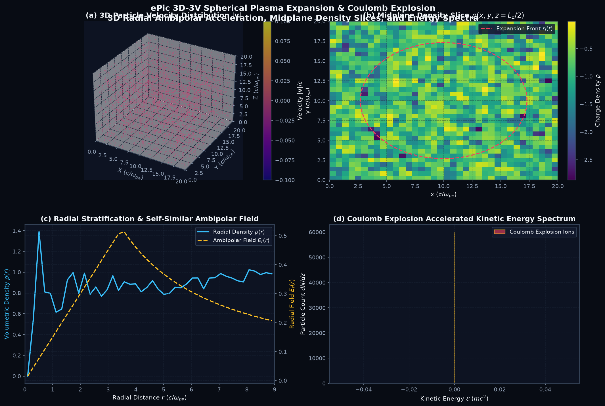
</p>

- **👁️ What You Are Looking At**:
  - **Panel (a)**: 3D volumetric scatter of kinetic particles colored by velocity magnitude $|\mathbf{v}|$.
  - **Panel (b)**: Midplane slice $\rho(x, y, z=L_z/2)$ showing the radial expansion contour $r_f(t)$.
  - **Panel (c)**: Spherical radial density profile $\rho(r)$ and radial ambipolar electric field $E_r(r)$ accelerating the outer ions.
  - **Panel (d)**: Kinetic energy spectrum of the Coulomb explosion accelerated ions.
- **🧠 The Physics**: Models laser-cluster Coulomb explosion and collisionless plasma expansion into space vacuum.
- **💻 Run Experiment**: `python experiments/3d_plasma_expansion.py`

---

## Theoretical Foundations

In-depth mathematical derivations and numerical formulations are available in `docs/theory/`:

1. [**01. PIC Fundamentals & Vlasov-Poisson Systems**](docs/theory/01_pic_fundamentals.md): Macroparticle weighting, normalization scales ($\omega_{pe}, \lambda_D, v_{th}$), and stability constraints ($\omega_{pe} \Delta t \le 0.1$).
2. [**02. The Symplectic Boris Algorithm**](docs/theory/02_boris_algorithm.md): Exact rotation derivation, leapfrog velocity staggering, and machine-precision magnetic invariants.
3. [**03. Field Solvers & Cloud-In-Cell Interpolation**](docs/theory/03_field_solvers_and_cic.md): Spectral discrete Laplacian eigenvalues ($k_{\text{eff}}^2$), dual adjoint interpolation, and zero self-force proof.
4. [**04. Kinetic Magnetic Reconnection & Harris Sheets**](docs/theory/04_magnetic_reconnection.md): Harris equilibrium pressure balance, plasmoid instability, and Cassak-Shay asymmetric reconnection scaling.

---

## Core Computational Engine

```
                      ┌────────────────────────────────────────┐
                      │          Particle Positions x^n        │
                      └──────────────────┬─────────────────────┘
                                         │  Cloud-in-Cell (CIC)
                                         ▼  Charge Deposition
                      ┌────────────────────────────────────────┐
                      │          Charge Density rho^n          │
                      └──────────────────┬─────────────────────┘
                                         │  Spectral Poisson Solver
                                         ▼  grad^2 phi = -rho / eps_0
                      ┌────────────────────────────────────────┐
                      │    Potential phi^n & Field E^n (Grid)  │
                      └──────────────────┬─────────────────────┘
                                         │  Inverse CIC Interpolation
                                         ▼  (Adjoint, Zero Self-Force)
                      ┌────────────────────────────────────────┐
                      │          Field E(x_p) at Particles     │
                      └──────────────────┬─────────────────────┘
                                         │  Symplectic Boris Pusher
                                         ▼  v^{n-1/2} -> v^{n+1/2}, x^n -> x^{n+1}
                      ┌────────────────────────────────────────┐
                      │    Updated Positions & Synchronized    │
                      │    Energy Conservation Diagnostics     │
                      └────────────────────────────────────────┘
```

### 1. Vectorized Boris Particle Pusher
Solves the Lorentz equation:
$$\frac{d\mathbf{v}}{dt} = \frac{q}{m} \left( \mathbf{E} + \mathbf{v} \times \mathbf{B} \right)$$
- **Symplectic Leapfrog Time-Centering**: Velocity is retarded by $-\Delta t/2$ at $t=0$, guaranteeing exact second-order global convergence $\mathcal{O}(\Delta t^2)$.
- **Exact Scalar Denominator**: Computes $1 + |\mathbf{t}|^2 = 1 + \mathbf{t}\cdot\mathbf{t}$ as a true scalar, preserving the magnetic invariant $|\mathbf{v}| = \text{const}$ to machine precision ($< 10^{-12}$).

### 2. Spectral (FFT) Poisson Solver
- Solves $\nabla^2 \phi = -\rho / \varepsilon_0$ in $\mathcal{O}(N \log N)$ operations via Fast Fourier Transforms.
- Uses exact finite-difference discrete Laplacian eigenvalues:
  $$k_{\text{eff}}^2 = \left(\frac{2}{\Delta x}\sin\frac{k_x \Delta x}{2}\right)^2 + \left(\frac{2}{\Delta y}\sin\frac{k_y \Delta y}{2}\right)^2 + \left(\frac{2}{\Delta z}\sin\frac{k_z \Delta z}{2}\right)^2$$
- Gauge-invariant: strictly sets $\hat{\phi}(0) = 0$ to prevent numerical potential drift.

### 3. Volume-Conserving Cloud-in-Cell (CIC)
- Implemented via vectorized index histograms (`np.bincount` / `np.add.at`).
- Dual adjoint deposition and interpolation kernels guarantee **exact momentum conservation and zero numerical self-force**.

---

## Installation & Setup

Clone the repository and set up your Python environment:

```bash
git clone https://github.com/avinash-tiwary/ePic.git
cd ePic

# Using standard venv + pip
python3 -m venv .venv
source .venv/bin/activate
pip install -r requirements.txt
pip install -e .

# Or using uv (recommended for 10x faster installation)
uv venv .venv
uv pip install -r requirements.txt
uv pip install -e .
```

---

## Running the Benchmark Experiments

Run any of the 10 physics experiments with one command:

```bash
# 1D Two-stream instability (phase space vortex & harmonic cascades)
python experiments/1d_two_stream.py

# 1D Collisionless Landau damping (analytic gamma_L envelope)
python experiments/1d_landau_damping.py

# 1D Non-linear Landau damping & O'Neil bounce oscillations
python experiments/1d_nonlinear_landau.py

# 1D Bump-on-tail quasilinear plateau relaxation
python experiments/1d_bump_on_tail.py

# 1D First-principles (k, omega) plasma dispersion relation
python experiments/1d_plasma_dispersion.py

# 1D Supersonic collisionless electrostatic shock wave
python experiments/1d_electrostatic_shock.py

# 2D Two-stream & transverse filamentation instability
python experiments/2d_two_stream.py

# 2D Symmetric Harris current sheet reconnection
python experiments/2d_harris_reconnection.py

# 2D Asymmetric dayside magnetopause reconnection (M.Sc. thesis)
python experiments/2d_asymmetric_reconnection.py

# 3D Spherical plasma expansion & Coulomb explosion
python experiments/3d_plasma_expansion.py

# Generate all 7 animated movies/GIFs
python experiments/generate_movies.py
```

---

## Automated Unit Tests

Run the full 13-test automated test suite:

```bash
pytest tests/
```

```
============================= test session starts ==============================
collected 13 items

tests/test_1d_pic.py .                                                   [  7%]
tests/test_2d_pic.py .                                                   [ 15%]
tests/test_3d_pic.py .                                                   [ 23%]
tests/test_boris.py ....                                                 [ 53%]
tests/test_cic.py ...                                                    [ 76%]
tests/test_poisson.py ...                                                [100%]

============================== 13 passed in 1.95s ==============================
```

---

## Scientific Bibliography

```bibtex
@article{boris1970relativistic,
  author  = {Boris, J. P.},
  title   = {Relativistic plasma simulation-optimization of a hybrid code},
  journal = {Proc. Fourth Conf. Num. Sim. Plasmas},
  pages   = {3--67},
  year    = {1970},
  publisher = {Naval Res. Lab, Wash. D.C.}
}

@book{birdsall2004plasma,
  author    = {Birdsall, C. K. and Langdon, A. B.},
  title     = {Plasma Physics via Computer Simulation},
  publisher = {CRC Press / Taylor & Francis},
  year      = {2004}
}

@book{hockney1988computer,
  author    = {Hockney, R. W. and Eastwood, J. W.},
  title     = {Computer Simulation Using Particles},
  publisher = {Adam Hilger, Bristol},
  year      = {1988}
}

@mastersthesis{himanshu2023reconnection,
  author  = {Himanshu, Avinash Kumar},
  title   = {Characterising Magnetic Reconnection in Asymmetric Medium},
  school  = {Department of Astronomy, Astrophysics and Space Engineering, Indian Institute of Technology Indore},
  year    = {2023},
  note    = {Advisor: Dr. Bhargav Vaidya}
}

@article{cassak2007scaling,
  author  = {Cassak, P. A. and Shay, M. A.},
  title   = {Scaling of asymmetric magnetic reconnection: General theory and collisional simulations},
  journal = {Physics of Plasmas},
  volume  = {14},
  number  = {10},
  pages   = {102114},
  year    = {2007}
}

@article{landau1946vibrations,
  author  = {Landau, L. D.},
  title   = {On the vibrations of the electronic plasma},
  journal = {Journal of Physics (USSR)},
  volume  = {10},
  pages   = {25},
  year    = {1946}
}

@article{oneil1965collisionless,
  author  = {O'Neil, T. M.},
  title   = {Collisionless damping of nonlinear plasma oscillations},
  journal = {The Physics of Fluids},
  volume  = {8},
  number  = {12},
  pages   = {2255--2262},
  year    = {1965}
}

@article{forslund1971formation,
  author  = {Forslund, D. W. and Freidberg, J. P.},
  title   = {Theory of Laminar Collisionless Electrostatic Shocks},
  journal = {Physical Review Letters},
  volume  = {27},
  number  = {18},
  pages   = {1189},
  year    = {1971}
}

@article{derouillat2018smilei,
  author  = {Derouillat, J. and others},
  title   = {SMILEI: A collaborative, open-source, multi-purpose particle-in-cell code for plasma simulation},
  journal = {Computer Physics Communications},
  volume  = {222},
  pages   = {351--373},
  year    = {2018}
}
```

---

## License

This project is licensed under the [MIT License](LICENSE).
